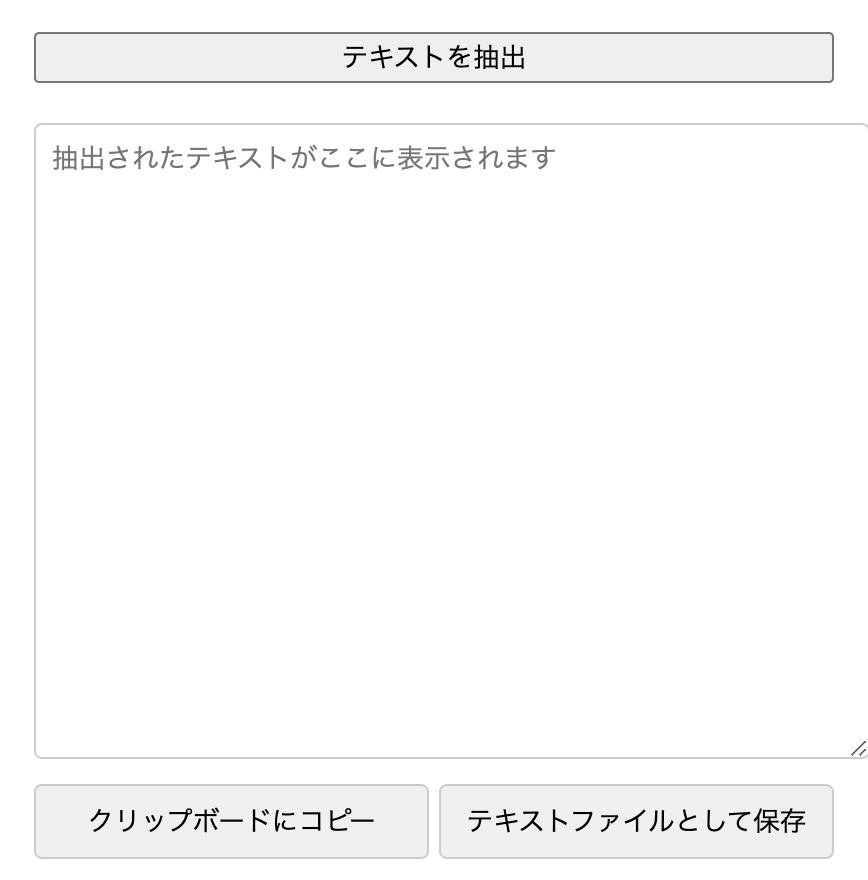

# Perplexity Text Extractor

Perplexityの会話内容を簡単に抽出・保存できるChrome拡張機能です。

## 機能

- Perplexityのページから会話テキストを抽出
- 抽出したテキストをクリップボードにコピー
- テキストファイルとしてダウンロード可能
- スクロール可能なテキストエリアで内容を確認

## インストール方法

1. このリポジトリをクローンまたはダウンロード：
   ```bash
   git clone https://github.com/hrtaym1114-github/perplexity-text-extractor.git   
   ```

2. Chrome拡張機能ページを開く：
   - Chromeブラウザで `chrome://extensions/` にアクセス
   - 右上の「デベロッパーモード」をオンにする

3. 「パッケージ化されていない拡張機能を読み込む」をクリック
   - ダウンロードしたフォルダを選択

## 使い方

1. Perplexityのページを開く
2. 拡張機能のアイコンをクリックし、「テキストを抽出」ボタンをクリック

3. 抽出したテキストの操作：
   - テキストエリアで内容を確認
   - 「クリップボードにコピー」でテキストをコピー
   - 「テキストファイルとして保存」でファイルとしてダウンロード

## スクリーンショット



## ファイル構成

perplexity-text-extractor/
├── manifest.json # 拡張機能の設定ファイル
├── popup.html # ポップアップUIのHTML
├── popup.js # ポップアップのロジック
├── content.js # コンテンツスクリプト
└── README.md # ドキュメント

## 必要な権限

- `activeTab`: 現在のタブにアクセス
- `clipboardWrite`: クリップボードへの書き込み
- `scripting`: コンテンツスクリプトの実行

## 既知の問題

- Perplexityのページ構造が変更された場合、テキスト抽出が機能しない可能性があります
- 長い会話の場合、読み込みに時間がかかることがあります

## 今後の改善予定

- [ ] 会話の自動保存機能
- [ ] マークダウン形式でのエクスポート
- [ ] 会話履歴の管理機能
- [ ] テーマのカスタマイズ機能

## ライセンス

このプロジェクトは MIT ライセンスの下で公開されています。詳細は [LICENSE](LICENSE) ファイルを参照してください。

## 作者
- GitHub: [@hrtaym1114-github](https://github.com/hrtaym1114-github)


---

**注意**: この拡張機能は Perplexity.ai の公式製品ではありません。利用は自己責任でお願いします。

